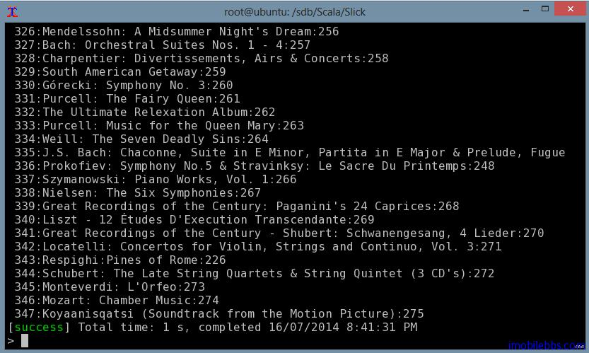
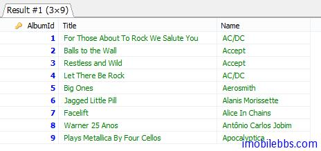

# 基本查询
我们准备好了开发环境，下面就来看看 Slick 的基本查询方法，我们打算查询 Chinook 中的 Album 表，我们先看看之前自动生成的代码中表 Album 的定义：
```
/** Entity class storing rows of table Album
   *  @param albumid Database column AlbumId PrimaryKey
   *  @param title Database column Title
   *  @param artistid Database column ArtistId  */
case class AlbumRow(albumid: Int, title: String, artistid: Int)
    /** GetResult implicit for fetching AlbumRow objects using plain SQL queries */
    implicit def GetResultAlbumRow(implicit e0: GR[Int], e1: GR[String]): GR[AlbumRow] = GR{
    prs => import prs._
    AlbumRow.tupled((<<[Int], <<[String], <<[Int]))
}
/** Table description of table Album. Objects of this class serve as prototypes for rows in queries. */
class Album(tag: Tag) extends Table[AlbumRow](tag, "Album") {
    ...
    /** Database column AlbumId PrimaryKey */
    val albumid: Column[Int] = column[Int]("AlbumId", O.PrimaryKey)
    /** Database column Title  */
    val title: Column[String] = column[String]("Title")
    /** Database column ArtistId  */
    val artistid: Column[Int] = column[Int]("ArtistId")

    /** Foreign key referencing Artist (database name FK_AlbumArtistId) */
    lazy val artistFk = foreignKey("FK_AlbumArtistId", artistid, Artist)
		(r => r.artistid, onUpdate=ForeignKeyAction.NoAction, onDelete=ForeignKeyAction.NoAction)
}
    /** Collection-like TableQuery object for table Album */
    lazy val Album = new TableQuery(tag => new Album(tag))
```
可以看到对于数据库中每个表，我们定义了一个 case class 代表表的一行，如 AlbumRow，一个 Table 类，比如 Album，还定义了一个 lazy 变量 Album，可以直接使用这个变量以集合类对象的方式来查询数据表。下面我们看看查询的基本用法：

我们在和 Tables.scala 的同一个目录下（本例为 com/guidebee/slick/example）创建一个 Example.scala 文件:
```
package com.guidebee.slick.example

import scala.slick.driver.MySQLDriver.simple._
import com.guidebee.slick.example.Tables._
// The main application
object Example extends App {

    Database.forURL("jdbc:mysql://127.0.0.1/Chinook",
        driver = "com.mysql.jdbc.Driver",
        user="user",
        password="password").withSession {
            implicit session =>
            // <- write queries here
            Album foreach { case AlbumRow(albumId,title,artistId) =>
            println(" " + albumId + ":" + title + ":" + artistId)
            }
        }

}
```
注意：修改正确的用户名和密码。

其中代码
```
    Database.forURL("jdbc:mysql://127.0.0.1/Chinook",
        driver = "com.mysql.jdbc.Driver",
        user="user",
        password="password").withSession {
          implicit session =>
          // <- write queries here
           
           }
        }
```
用来连接数据库，并且创建一个 Session 对象，所有数据库相关查询都可以在这个代码块中实现，这里我们打印出 Album 中所有记录：

Album 为一集合对象，因此我们可以使用 Scala 集合对象支持的方法，来过滤，比较，比如：
```
val q1= for (a <- Album;if a.albumid<10)
     yield (a.albumid,a.title,a.artistid)
q1 foreach println
```
显示前9条记录：
(1,For Those About To Rock We Salute You,1)
(2,Balls to the Wall,2)
(3,Restless and Wild,2)
(4,Let There Be Rock,1)
(5,Big Ones,3)
(6,Jagged Little Pill,4)
(7,Facelift,5)
(8,Warner 25 Anos,6)
(9,Plays Metallica By Four Cellos,7)
```
val q1= for (a <- Album;if a.albumid<10)
    yield a.albumid.asColumnOf[String] ++ LiteralColumn(":") ++ a.title
q1 foreach println
```
1:For Those About To Rock We Salute You
2:Balls to the Wall
3:Restless and Wild
4:Let There Be Rock
5:Big Ones
6:Jagged Little Pill
7:Facelift
8:Warner 25 Anos
9:Plays Metallica By Four Cellos

我们再来看看多个表 Join 的情况：先看看直接使用 SQL 语句
```
select album.AlbumId,album.Title,artist.Name from album
INNER JOIN artist 
ON album.ArtistId=artist.ArtistId
WHERE album.AlbumId<10
```

那么使用 Scala 语句如何实现呢，也就是多个集合对象 Join 的情况：
```
val q3 = for {
	a <- Album if a.albumid < 10
	t <- Artist if a.artistid===t.artistid 
}  yield (a.albumid,a.title,t.name)
q3 foreach println
```
注意，比较运算符为===，我们也可以直接使用外键来查询，
在 Tables.scala，类 Album 中定义了一个外键 artistFk
```
val q2 = for {
	a <- Album if a.albumid < 10
	t <- a.artistFk
} yield (a.albumid,a.title,t.name)
q2 foreach println
```
两种方法都输出如下结果：
```
(1,For Those About To Rock We Salute You,Some(AC/DC))
(2,Balls to the Wall,Some(Accept))
(3,Restless and Wild,Some(Accept))
(4,Let There Be Rock,Some(AC/DC))
(5,Big Ones,Some(Aerosmith))
(6,Jagged Little Pill,Some(Alanis Morissette))
(7,Facelift,Some(Alice In Chains))
(8,Warner 25 Anos,Some(Antônio Carlos Jobim))
(9,Plays Metallica By Four Cellos,Some(Apocalyptica))
```