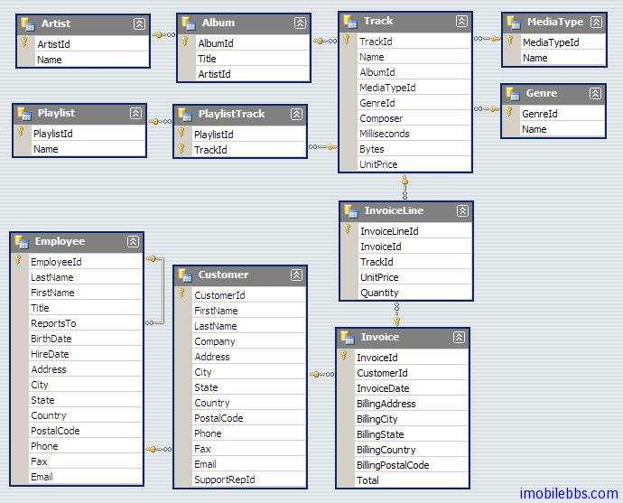

# 概述  
Slick 对于 Scala 来说，有如 LINQ 至于 C#，或者类似于其它平台上的 ORM 系统，它使用应用使用数据库有如使用 Scala 内置的集合类型（比如列表，集合等）一样方便。当然如有需要你还是可以直接使用 SQL 语句来查询数据库。

下面为使用 Slick 的代码片段：
```
val limit = 10.0

// Your query could look like this:
( for( c <- coffees; if c.price < limit ) yield c.name ).list

// Or using more plain SQL String Interpolation:
sql"select COF_NAME from COFFEES where PRICE < $limit".as[String].list

// Both queries result in SQL equivalent to:
// select COF_NAME from COFFEES where PRICE < 10.0
```
使用 Slick 而不直接使用 SQL 语句，可以使用编译器帮助发现一些类型错误，同时 Slick 可以为不同的后台数据库类型生成查询。
它具有如下的一些特征：
## Scala    
所有查询，表格和字段映射，以及类型都采用普通的 Scala 语法。
```
class Coffees(tag: Tag) extends Table[(String, Double)](tag, "COFFEES") {
    def name = column[String]("COF_NAME", O.PrimaryKey)
    def price = column[Double]("PRICE")
    def * = (name, price)
}
val coffees = TableQuery[Coffees]
```
数据访问接口类型 Scala 的集合类型
```
// Query that only returns the "name" column
coffees.map(_.name)

// Query that does a "where price < 10.0"
coffees.filter(_.price < 10.0)
```
## 类型安全  
你使用的 IDE 可以帮助你写代码
在编译时而无需到运行时就可以发现一些错误
```
// The result of "select PRICE from COFFEES" is a Seq of Double
// because of the type safe column definitions
val coffeeNames: Seq[Double] = coffees.map(_.price).list

// Query builders are type safe:
coffees.filter(_.price < 10.0)
// Using a string in the filter would result in a compilation error
```
## 可以组合  
查询接口为函数，这些函数可以多次组合和重用。
```
// Create a query for coffee names with a price less than 10, sorted by name
coffees.filter(_.price < 10.0).sortBy(_.name).map(_.name)
// The generated SQL is equivalent to:
// select name from COFFEES where PRICE < 10.0 order by NAME
```
## 支持的数据库系统  
 - DB2 (via slick-extensions)
 - Derby/JavaDB
 - H2
 - HSQLDB/HyperSQL
 - Microsoft Access
 - Microsoft SQL Server (via slick-extensions)
 - MySQL
 - Oracle (via slick-extensions)
 - PostgreSQL
 - SQLite
对于其它的一些数据库类型 Slick 也提供了有限的支持。

## 查询接口 Lifted Embedding
Sclick 使用 Lifted Embedding 作为标准的数据库查询接口，此外 Direct Embedding 接口正在开发测试当中。

Lifted Embedding 的名称来自于，你不是使用标准的 Scala 数据类型来访问查询数据库，而是使用 Rep 构造器来提升（Lift）Scala 的基本数据类型，然后使用提升后的数据类型来访问数据库，比如标准的 Scala 集合的例子：
```
case class Coffee(name: String, price: Double)
val coffees: List[Coffee] = //...

val l = coffees.filter(_.price > 8.0).map(_.name)
//                       ^       ^          ^
//                       Double  Double     String
```
而对应的提升之后的例子：
```
class Coffees(tag: Tag) extends Table[(String, Double)](tag, "COFFEES") {
    def name = column[String]("COF_NAME")
    def price = column[Double]("PRICE")
    def * = (name, price)
}
val coffees = TableQuery[Coffees]

val q = coffees.filter(_.price > 8.0).map(_.name)
//                       ^       ^          ^
//               Rep[Double]  Rep[Double]  Rep[String]
```
所有的基本 Scala 类型，都提升为 Rep。即使是 8.0 字面量也被提升为 Rep[Double] 类型。

后面的例子，我们会采用 Chinook 数据库作为例子。

Chinook 数据库前身为著名的 Northwind 数据库，它的数据模型如下：
